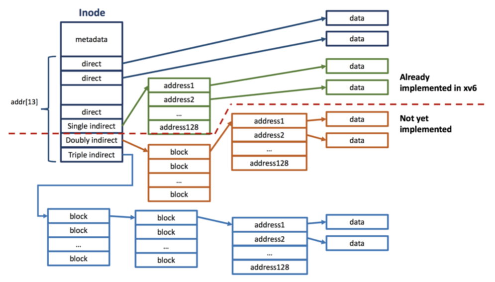
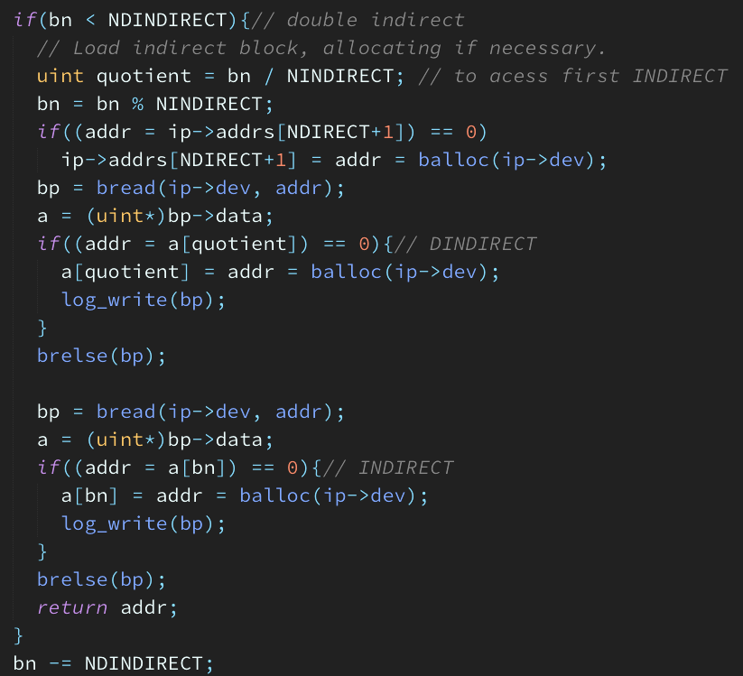
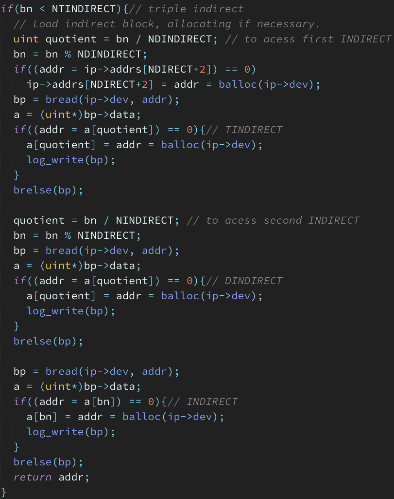
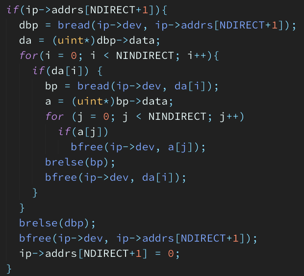
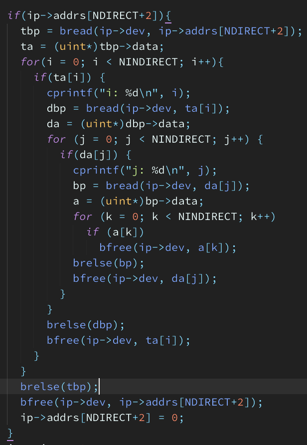
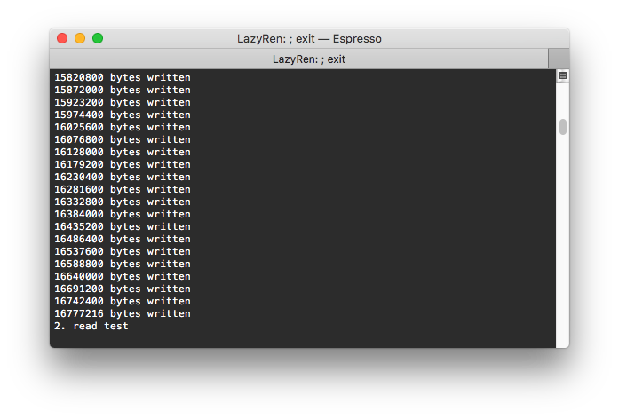
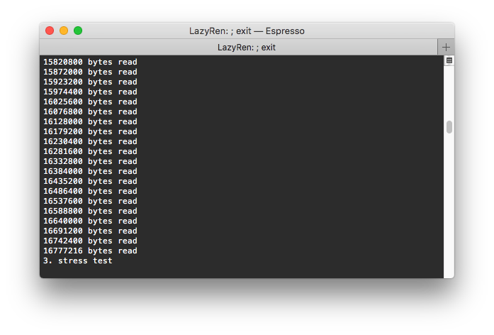
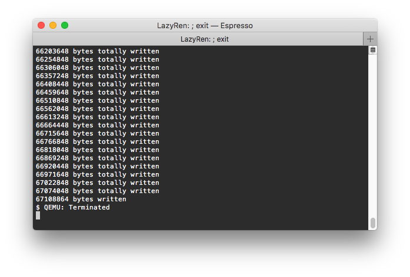

# Large File System implemented xv6

# Original xv6 File System

기존 xv6는 각각의 파일당 하나의 inode를 유지하며 inode에는 inum, ref, lock, valid, type 등 많은 metadata와 13개의 실제 data block을 가르키는 addr 변수를 가지고 있습니다. 이 13개의 addr중 마지막 1개를 제외한 12개는 direct block addr로 쓰이며 마지막은 하나의 data block을 indirect block으로 사용하여 하나의 inode는 총 12 + (BSIZE / sizeof(uint)), 즉 140개의 data block을 가리킬 수 있습니다. 각각의 data block은 512 bytes 이므로 xv6 내에서 사용가능한 최대 파일의 크기는 70KB 밖에 안됩니다. 더 큰 파일을 사용하기 위해서는 inode는 address system에 double, triple indirect block addressing을 접목시켜야합니다.

# Supporting Large File

Inode의 총 addr 변수의 크기는 13으로 고정되어 있으며 이를 변경하진 않을 예정입니다. 그렇기 때문에 define된 NDIRECT를 12 -> 10 으로 변경해준 뒤 마지막 2개를 추가적으로 doubly indirect, triple indirect로 사용합니다. 이를 통해 총 10 + 128 + 128^2 + 128^3 = 2113674개의 data block을 커버할 수 있으며 이는 약 1032MB 크기의 파일을 가질 수 있게 됨을 의미합니다. 

# Implementation

변경해야 하는 함수는 2개입니다.

1. `static uint bmap(struct inode *ip, uint bn)`: writei, readi와 같이 실제 파일 데이터에 접근하는 함수에서 사용됩니다. 접근하려는 block number(bn)이 할당되어 있지 않으면 `balloc()`을 이용하여 할당한 후 해당 block의 addr를 리턴합니다. 
2. `static void itrunc(struct inode *ip)`: inode가 더이상 사용되지 않을때 inode가 사용했었던 data block들을 정리해줍니다. 

기존의 존재하던 코드에서 indirect 상황을 참고하여 doubly와 triple 상황을 추가해 주면 됩니다. 

# Result

Doubly indirect까지 사용하였을 경우 File System은 8MB를 조금 넘는 크기의 파일까지 사용이 가능합니다. 

테스트에서 읽고, 쓰고, 삭제하는 파일의 크기는 16MB이므로 triple indirect까지 사용하였을 때만 접근이 가능합니다. 

