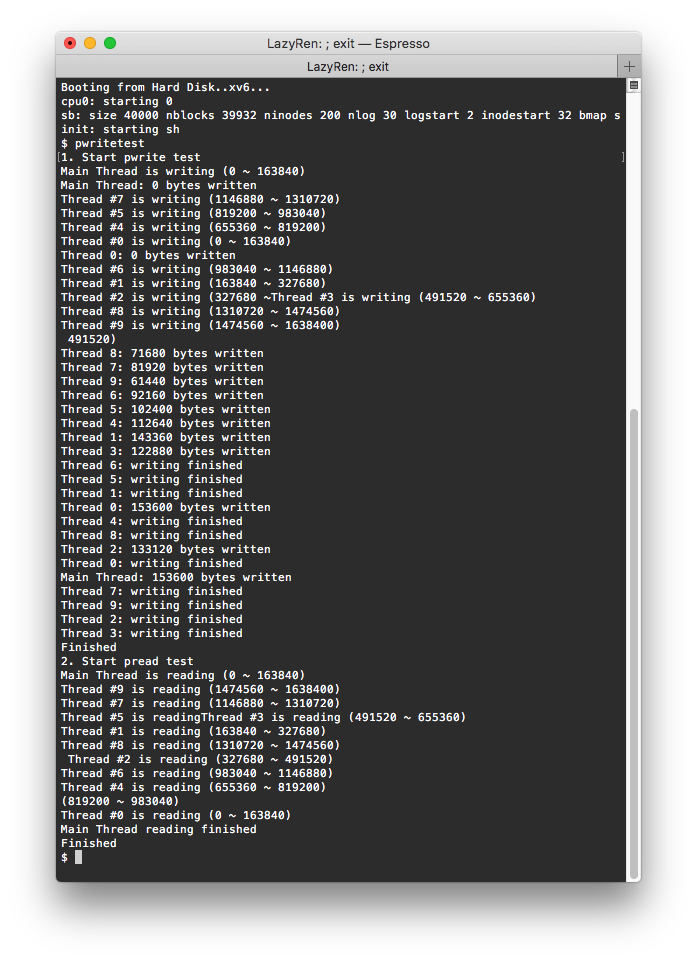

# Large File System implemented xv6

# Original xv6 File System

기존 xv6는 각각의 파일당 하나의 inode를 유지하며 inode에는 inum, ref, lock, valid, type 등 많은 metadata와 13개의 실제 data block을 가르키는 addr 변수를 가지고 있습니다. 이 13개의 addr중 마지막 1개를 제외한 12개는 direct block addr로 쓰이며 마지막은 하나의 data block을 indirect block으로 사용하여 하나의 inode는 총 12 + (BSIZE / sizeof(uint)), 즉 140개의 data block을 가리킬 수 있습니다. 각각의 data block은 512 bytes 이므로 xv6 내에서 사용가능한 최대 파일의 크기는 70KB 밖에 안됩니다. 더 큰 파일을 사용하기 위해서는 inode는 address system에 double, triple indirect block addressing을 접목시켜야합니다.

# Supporting Large File

Inode의 총 addr 변수의 크기는 13으로 고정되어 있으며 이를 변경하진 않을 예정입니다. 그렇기 때문에 define된 NDIRECT를 12 -> 10 으로 변경해준 뒤 마지막 2개를 추가적으로 doubly indirect, triple indirect로 사용합니다. 이를 통해 총 10 + 128 + 128^2 + 128^3 = 2113674개의 data block을 커버할 수 있으며 이는 약 1032MB 크기의 파일을 가질 수 있게 됨을 의미합니다. 

# Implementation

변경해야 하는 함수는 2개입니다.

1. `static uint bmap(struct inode *ip, uint bn)`: writei, readi와 같이 실제 파일 데이터에 접근하는 함수에서 사용됩니다. 접근하려는 block number(bn)이 할당되어 있지 않으면 `balloc()`을 이용하여 할당한 후 해당 block의 addr를 리턴합니다. 
2. `static void itrunc(struct inode *ip)`: inode가 더이상 사용되지 않을때 inode가 사용했었던 data block들을 정리해줍니다. 

기존의 존재하던 코드에서 indirect 상황을 참고하여 doubly와 triple 상황을 추가해 주면 됩니다. 

# Result

Doubly indirect까지 사용하였을 경우 File System은 8MB를 조금 넘는 크기의 파일까지 사용이 가능합니다. 

테스트에서 읽고, 쓰고, 삭제하는 파일의 크기는 16MB이므로 triple indirect까지 사용하였을 때만 접근이 가능합니다. 

# pread & pwrite Implementation

열린 파일의 오프셋(xv6의 f->off로 나타내어지는)이 아닌 파일에서 원하는 오프셋으로 이동하여 읽고, 쓸 수 있는 새로운 system call을 추가하는 작업입니다. 함수호출 이후에 기존 파일의 오프셋에는 변함이 없어야합니다.

## Implementation

해당 함수들의 추가를 위하여 세 파일을 변경합니다. 기존 존재하던 pread, write 관련 함수들을 변경한 함수들에는 'p'가 붙어있음에 주의합니다.

- sysfile.c 
	- `int sys_pread(void)` sys_read에 추가하여 4번째 인자 offset을 읽은 후 `int filepread()` 함수를 호출합니다. 
	- `int sys_pwrite(void)` sys_write에 추가하여 4번째 인자 offset을 읽은 후 sys_read에 추가하여 4번째 인자 offset을 읽은 후 `int filewrite()` 함수를 호출합니다. 
- file.c
	* `int filepread(struct file *f, char *addr, int n, uint off)` f->off를 더이상 변경하지 않습니다.
	* `int filepwrite(struct file *f, char *addr, int n, uint off)` `writei()`가 아닌 `pwritei()`를 호출하며, f->off를 더이상 변경하지 않습니다. 
- fs.c
	* `int pwritei(struct inode *ip, char *src, uint off, uint n)` `writei()` 함수에서 딱 한 줄이 변경됩니다. ` if(off > ip->size || off + n < off)` 부분에서 off > ip->size를 체크하는 부분이 사라지며 이로 인해 write하려는 부분의 offset이 현재 파일크기보다 클 경우에도 정상적으로 `pwrite()`가 가능해집니다. 이는 `bmap()` 함수 내부에서 현재 offset이 위치하는 블럭이 할당되지 않았을 경우 자동으로 할당해주기 때문에 가능한 방법입니다.

## Results

무명의 학우분께서 Piazza에 올려주신 테스트 케이스에 offset이 변경되지 않음을 체크하는 약간의 변경을 추가하여 테스트를 진행하였습니다.  메인 스레드는 일반 `write()`, `read()`  함수를 호출하며 파일의 오프셋을 변경해가며 데이터를 확인하므로 스레드들이 `pread()`, `pwrite()`를 호출하여도 f->off가 변경되지 않음을 확실시 합니다. 테스트 출력결과를 통해 현재 파일의 크기보다 큰 offset에 `pwrite()`를 호출하여도 정상적으로 데이터가 write됨을 확인할 수  있습니다.

