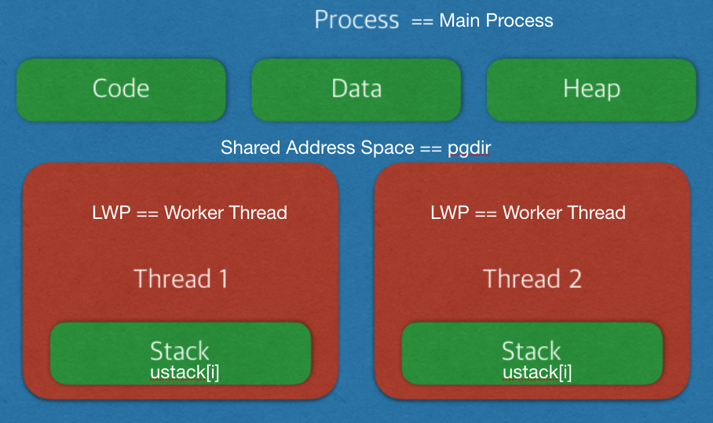
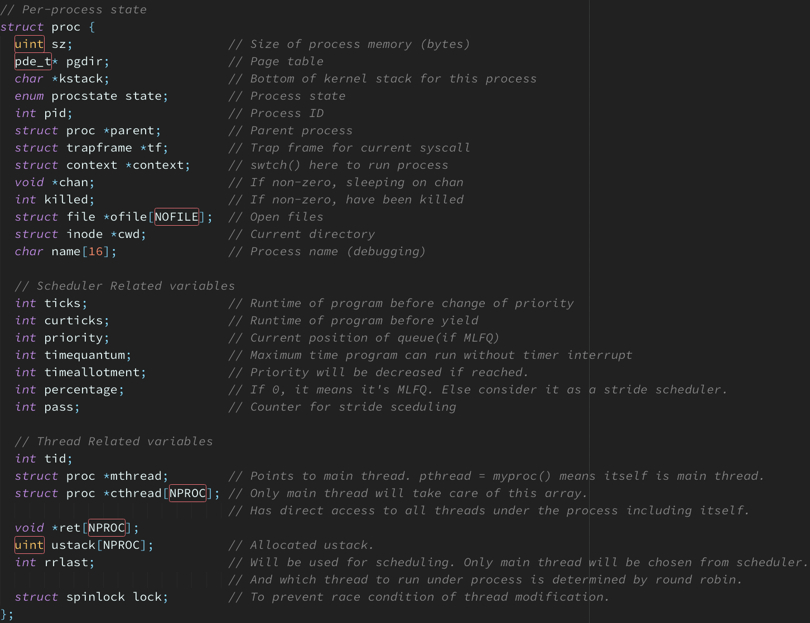
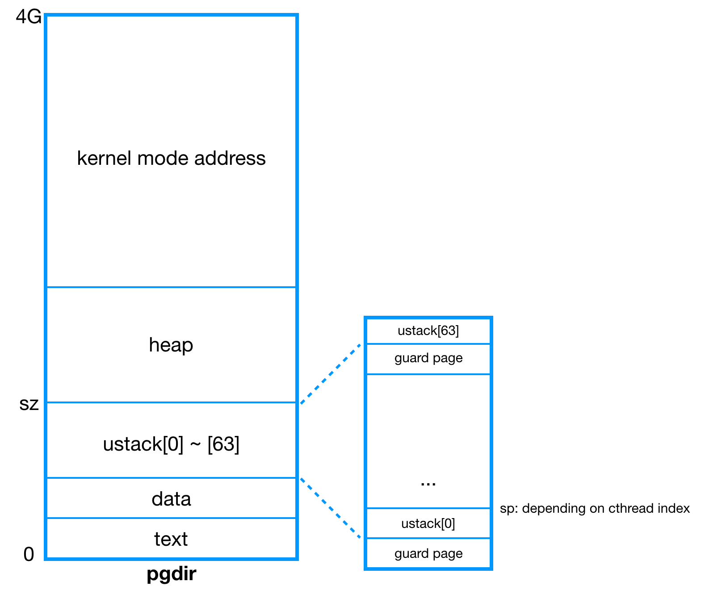
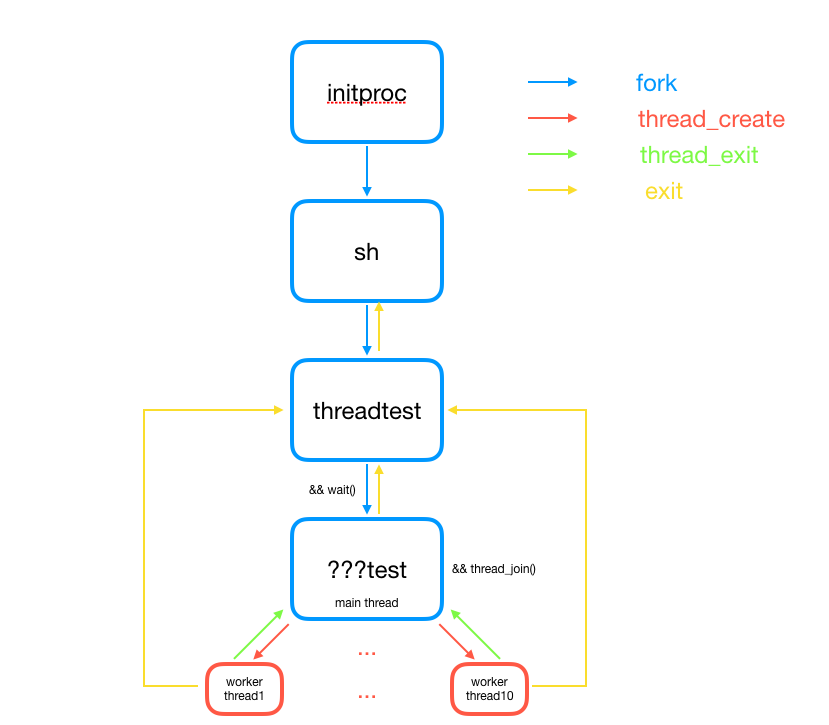
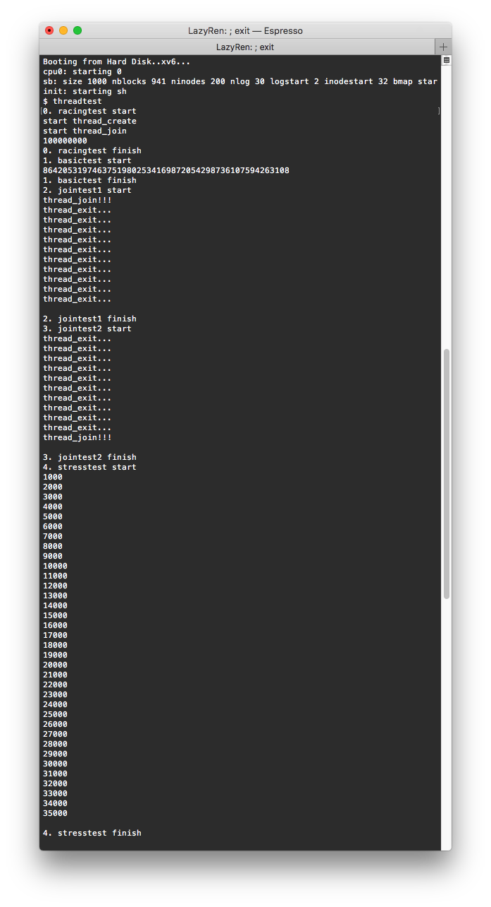
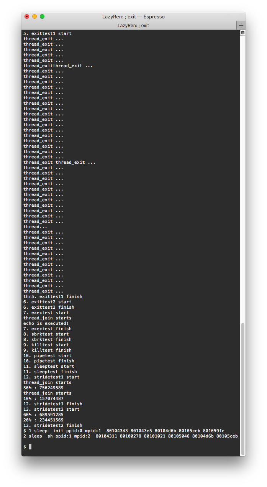
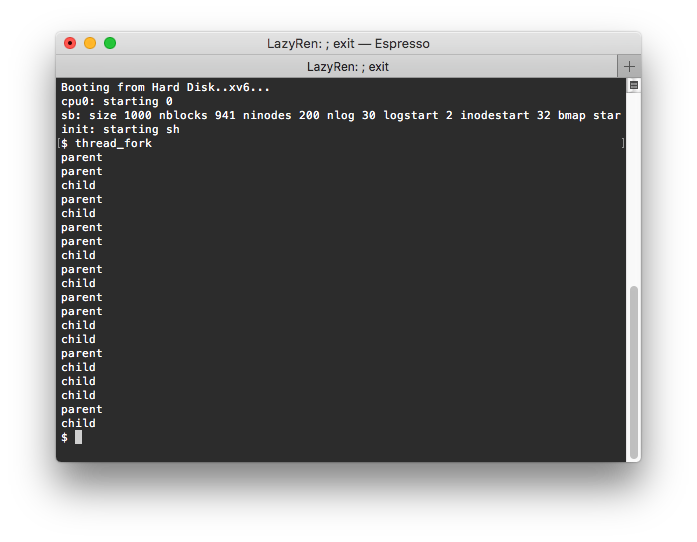

# LWP(thread) implemented xv6

# Table of Contents

<!--ts-->

* [Terminology](#terminology)
* [Proc Structure](#proc-structure)
* [Functions](#functions)
	* [Newly Created](#newly-created)
	* [Fixed](#fixed)
* [Design Policy](#design-policy)
	* [Scheduling](#scheduling)
	* [Process and Threads](#process-and-threads)
* [Test & Result](#test--result)

<!--te-->

 

# Terminology

현재 사용된 LWP 구현은 linux의 명세를 많이 따랐습니다. 
이에 혼용을 최소화 하기 위하여 기존 프로세스를 main thread, LWP를 worker thread(코딩 도중에는 child thread라 생각하여 cthread가 약자임)라 칭하도록 하겠습니다. 
xv6는 프로세스가 스케쥴링의 기본 단위임에도 불구하고, 스레드가 스케쥴링의 기본 단위인 리눅스의 명세를 따르다보니 디자인할시에 헷갈리는 부분이 생겨 기본적으로 LWP는 단일로 존재할 수 있는 프로세스가 아닌 메인 스레드에 속해있는 스레드라고 생각하고 디자인을 하였습니다. 
즉 어떠한 상황에서도 프로세스가 사용되어야 할 자리에 작업 스레드가 나올 수 없습니다. 

* LWP는 부모 프로세스가 될 수 없습니다. LWP가 fork를 호출할경우 해당 스레드 내용이 fork되지만 부모 프로세스는 curproc->mproc 즉 메인 스레드입니다. 그렇기 때문에 `waitpid()` 함수가 없는 지금 특정 스레드가 자신이 포크한 child만을 기다리는 방법은 존재하지 않습니다.(fork_test) 
* LWP는 메인 스레드와 같은 pid를 가지고 있습니다. 기존에 분배하던 nextpid 값은 tid가 소유하며 이는 이전 pid와 마찬가지로 `allocproc()`이 호출될 때마다 증가하는 값을 가집니다. 
* LWP는 새롭게 생성된 변수인 `cthread[NPROC]`, `ustack[NPROC]`, `rrlast`, `spinlock` 등을 관리하지 않습니다. 이 변수들은 프로세스내에서 메인 스레드만이 관리하는 변수들입니다. 
* LWP는 sleep / wakeup 시에 메인 스레드를 chan으로 사용합니다. 이는 곧 wakeup 호출 시 해당 프로세스 내의 잠자고 있던 모든 스레드를 깨운다는 뜻입니다. 다시 일어난 스레드는 조건을 확인한 이후 필요할 경우 다시 잠들게 됩니다. 

현 README에선 한글로 통일화를 위하여 main thread == 메인 스레드, worker thread == 작업 스레드 라는 용어를 사용하도록 하겠습니다. 
코드에서 통일되게 사용된 변수들은 mproc/mthread == 메인 스레드, curproc == 현재 프로세스(스레드), cthread == 작업 스레드 등이 있습니다. proc 구조체 내부의 변수와 함수에서 사용되는 변수를 구분하고 기존 코드와의 통일성 유지를 위하여 부득이하게 thread/proc 용어가 혼용되어 사용되었습니다. 

 

# Proc Structure

스레드와 관련되어 추가된 변수들은 proc 구조체에서 아래쪽에 위치하고 있습니다. 

* `int tid`: `allocproc()`에서 pid와 같은 값으로 초기화 됩니다. 만약 메인 스레드라면 pid == tid이며 작업 스레드의 pid는 메인 스레드와 같기 때문에 tid 값으로 관리합니다. 함수 콜에서 사용하는 pthread_t는 해당 tid를 사용하여 스레드를 관리합니다. 

 

* `struct proc *mthread`: 현재 스레드의 메인 스레드를 가리킵니다.  
     메인 스레드는 자기자신을 가리키고 있기 때문에 현재 proc이 메인 스레드인지 작업 스레드인지는 curproc->mthread == curproc 을 확인하면 됩니다. 

 

* `struct proc *cthread[NPROC]`: 메인 스레드는 cthread 배열 구조체를 이용하여 직접적으로 작업 스레드에 접근할 수 있습니다. cthread[i] == NULL이라면 해당 index는 아직 비어있는 상태라고 판단합니다. 이때의 index를 이용하여 `*ret[]`과 `ustack[]`에 접근하기 때문에 해당 index는 중요합니다. cthread[i]는 `thread_create()`에서 할당되며, `thread_join()`, `wait()`, `exit()`에서 해제될 수 있습니다. 
     **구현의 편의성을 위하여 cthread[0]은 항상 메인 스레드입니다.** 

 

* `void *ret[NPROC]`: `thread_exit()`에서 retval 값을 할당받아 저장합니다. 해당 값은 `thread_join()`에서 사용됩니다. **`thread_exit()`을 부르지 않고 작업 스레드가 start_routine에서 return하며 종료될 시에 retval은 저장되지 않습니다.** 
     이는 xv6에서 main함수가 exit()을 호출하지 않고 return 할 경우 에러가 발생하는 디자인을 따른 결과입니다. 작업 스레드가 `exit()` 혹은 `thread_exit()` 호출하지 않았을 경우 이는 곧 undefined behavior이며 이에 대한 책임은 user에게 있습니다. 

 

* `uint ustack[NPROC]`: ustack 배열은 `exec()` 배열에서 `allocuvm()`을 통해 딱 한번 할당됩니다. 할당된 ustack은 `deallocuvm()`을 호출하지 않고 `memset()`을 이용해 초기화하며 재사용됩니다. 이를 통해 ustack이 항상 pgdir에서 힙영역과 섞이지 않고 아래쪽에 유지될 수 있습니다. pgdir이 free될때 함께 free되기 때문에 할당과 반환 모두 `exec()`에서 이루어집니다. 이외의 함수는 해당 값을 할당/반환 하지 않고 사용합니다. 

     

* `int rrlast`: stride scheduler에서 round robin을 구현하기 위해 사용되는 변수입니다. 자세한 정보는 [Design Policy](#design-policy)에서 서술하겠습니다. 

 

* ~~`struct spinlock lock`: 동시 다발적으로 메인 스레드의 정보를 update하는 과정에서 race condition이 일어나는 것을 방지하기 위해 사용되는 락입니다.~~ 
     ~~ptable 락을 잡을 경우 필요가 없지만 이는 더 큰 overhead를 불러올 수 있기때문에 적용하였으며, multi cpu 상황에서 발생할 수 있는 race condition 방지용이기에 CPUS=1인 상황에서는 존재유무가 영향을 미치지 않습니다.~~ ptable.lock을 사용하는 것으로 변경하였습니다. 

 

# Functions

LWP implementation을 위하여 4개의 새로운 함수가 추가되었으며 그 중 3개는 system call입니다. 또한 기존에 존재하던 함수들 또한 변경되었으며 이들은 다음과 같습니다.

 

## Newly Created

- `int thread_create(thread_t *thread, void *(*start_routine)(void *), void *arg)`: system call 
  새로운 작업 스레드(LWP)를 생성합니다. `fork()`의 경우 새로운 메인 스레드를 생성하는 반면 `thread_create()`는 현재 프로세스(main/worker thread의 상관없이)의 메인 스레드의 영향 아래에 있는 작업 스레드를 생성하기 때문에 이에 맞춰 몇가지 작업을 진행하여야 합니다. 

  1. 메인 스레드의 cthread 배열에서 빈 곳을 찾습니다. 해당 cthread[i]가 자기자신을 가리키도록 한 이후 동일 index를 사용하여 ustack[i]을 사용합니다. 이때 ustack과 guard page 모두 할당된 상태이기 때문에 `memset()`을 이용해 초기화 한 이후 바로 사용합니다. 

  2. pgdir, sz, tf등을 main thread와 동일하게 할당한 이후 tf->esp만 ustack[i]을 사용하도록 합니다. 

  3. thread와 관련된 struct proc 변수를 세팅합니다. pid와 parent를 메인 스레드와 동일하게 할당하며 반환할 param인 thread_t = np->tid로 할당합니다. np->mthread = mproc, 즉 main thread 세팅과 tf->eip를 start_routine으로 변경해준뒤 마지막으로 메인 스레드가 MLFQ인 경우에만 initpush를 통해 MLFQ에 넣습니다. 

     

- `void thread_exit(void *retval)`: system call 만약 main thread가 `thread_exit()`을 호출하였을 경우 `exit()`을 통해 해당 프로세스 자체를 종료합니다. 메인 스레드가 종료된 프로세스는 존재의미가 없다고 판단하기 때문입니다. 해당 스레드의 파일들을 닫고 *retval을 메인 스레드의 ret[i]에 저장하여 후에 메인 스레드가 사용할 수 있도록 한 이후 ZOMBIE로 상태를 변경한 이후 sched()를 통해 scheduler를 호출합니다. 

   

- `int thread_join(thread_t thread, void **retval)`: system call `thread_exit()`을 통해 저장된 retval을 얻어오고 ZOMBIE로 변한 proc을 정리합니다. 만약 `thread_join()`이 `thread_create()`보다 먼저 호출되었다면 -1을 리턴하여 오류를 나타냅니다. 만약 이후에 다시 `thread_create()`가 일어났다 하더라도 `thread_join()`을 다시 호출하지 않는 한 해당 retval을 확인할 방법은 존재하지 않습니다. 그렇기 때문에 `thread_join()`과 `thred_create()`에 실행 순서를 주의하여야합니다. 다만 `thread_join()`과 `thread_exit()` 중 누가 먼저 호출되었는지는 상관이 없습니다. `thread_join()`은 정상적으로 retval을 확인하며 ZOMBIE proc을 정리할 수 있습니다. 

   

- `int killzombie(struct proc* curproc)` 
  인자로 받은 프로세스의 스레드 중 ZOMBIE인 스레드들은 정리합니다. 해당 함수를 호출할때에는 극히 조심하여야 합니다. `wait()`혹은 `thread_join()`을 통해 기다리던 스레드가 원하는 반환값을 못 받을 수도 있기 때문입니다. 그렇기에 `killzombie()`는 `exit()`, `wait()`, `exec()` 세 함수에서 메인 스레드가 정리될 시에만 호출됩니다. 해당 함수를 호출함으로서 ZOMBIE 프로세스가 불필요하게 ZOMBIE 상태를 오랫동안 유지하는 것을 방지합니다. `killzombie()` 함수는 ptable의 proc 구조체들을 직접적으로 변경하기 때문에 ptable.lock을 잡아주어야 합니다. 
  **기존에 thread_fork에서 발생하던 thread_join에러는 확인 결과 자고 있어야할 shell이 순간 일어나면서 스레드를 정리해주어서 발생하는것으로 확인 되었습니다. 이는 기본적으로 `exit()`에서만 사용하려고 처음 디자인 하였던 `killzombie()`를 다른 곳에서도 사용하면서 몇가지 변경을 하였는데, 그 과정에서 `wakeup1(pproc)` 라인이 제거가 되지 않아 shell을 깨우게 되었던 것으로 확인 되었습니다.**

 

## Fixed

- `int set_cpu_share(int percentage)` 호출한 프로세스의 메인 스레드의 stride ticket을 설정합니다. [Design Policy](#Design-Policy)에서 설명하였듯이 stride scheduler는 메인 스레드만을 관리하며 메인 스레드가 선택되었을때 내부에서 rrlast 변수를 이용하여 메인 스레드를 포함한 작업 스레드 간의 실행은 round robin policy를 준용하여 실행됩니다. cpu_share가 설정되지 않았을 경우 모든 스레드들은 MLFQ scheduler의 영향을 받으며 새로 fork, exec를 실행한 프로세스 또한 기존 프로세스의 cpu share에 상관없이 MLFQ의 영향을 받습니다. 

   

- `struct proc* allocproc(void)` 
  proc 구조체 내에 추가된 thread 관련 변수들을 초기화 해줍니다. 이때의 초기화는 현재 스레드가 메인 스레드라는 가정하에 이루어지므로 작업 스레드를 생성하려 하였다면 `allocproc()` 호출 이후 추가적인 작업이 요구됩니다. 

   

- `int growproc(int n)` 호출한 스레드가 포함된 프로세스의 힙 사이즈를 증가시킵니다. sz는 모든 스레드들이 공유하는 변수이기 때문에 메인 스레드와 작업 스레드 모두 해당 값을 변경해줍니다. 

   

- `int fork(void)` 메인 스레드와 작업 스레드 모두 `fork()`를 호출 할 수 있습니다. 어떤 스레드가 호출하였던간에 새로이 fork된 프로세스에는 호출한 스레드를 제외한 기존의 스레드들은 모두 사라진 채로 fork됩니다. 이는 즉 작업 스레드가 `fork()`를 호출하였을 경우 작업 스레드가 새로운 메인 스레드로 변경되며 이에 따라 proc 구조체의 변수들의 세팅이 필요하다는 것 입니다. 또한 새로운 프로세스의 parent는 기존 프로세스의 메인 스레드입니다. 일련의 과정을 통해 작업 스레드가 fork()를 사용하였다 하여도 child가 실제로 자신을 fork한 작업 스레드가 누구인지 확인할 방도가 존재하지 않습니다. 이는 즉 wait()에서 특정 child를 기다리는 것이 불가능 함을 의미합니다. 이는 정상적인 linux POSIX design이며 더 자세한 사항은 다음을 참고하시기 바랍니다.([wait(3) man page](https://linux.die.net/man/3/wait)) 

   

- `void exit(void)` `exit()`이 호출된 프로세스의 모든 스레드들의 상태를 ZOMBIE로 변경합니다. 또한 해당 프로세스의 자식들을 모두 현 프로세스의 부모에게 넘겨줍니다. 이후 `killzombie()`를 호출하여 새로이 생성된 ZOMBIE들을 처리해줍니다. 

   

- `int wait(void)` `wait()`을 부른 스레드의 프로세스를 부모로 갖는 스레드 중 ZOMBIE가 존재한다면 정리 후에 리턴 합니다. 만약 ZOMIBE가 없다면 메인 스레드를 chan으로 두고 sleep 합니다. 모든 sleep / wakeup은 메인 스레드를 chan으로 두고 일어나기 때문에 프로세스 내의 모든 스레드가 동시에 wakeup 콜을 받게 되어 일어나게 되지만 조건을 확인하고 필요한 스레드들은 다시 sleep 상태로 변하기 때문에 문제가 되지 않습니다. wait() 함수는 따로 기다리던 스레드가 메인 스레드인지 작업 스레드인지 구분하지 않습니다. 이는 `thread_exit()`시에 메인 스레드만을 wakeup 시키기 때문에 `thread_join()`과 `wait()`이 병목하여 undefined behavior를 일으키는 상황은 정상적인 상황하에 없으며, 해당 상황의 발생은 user의 책임으로 넘어가기 때문입니다. 

	 

- `int exec(char *path, char **argv)` `exec()` 함수는 실제 pgdir을 셋팅하는 매우 중요한 함수입니다. 새로이 pgdir을 생성하여 기존에 진행하던 할당을 모두 진행하면서 동시에 이후 작업 스레드들이 사용할 64개의 유저 스택을 미리 생성해 둡니다. 이를 통해 address space내에서 힙과 스텍이 섞이는 상황을 방지하며 alloc, dealloc이 exec에서만 일어나기 때문에 스텍을 관리하기가 훨씬 편해집니다. 스텍들의 시작 지점은 ustack 배열을 통해 관리하며 새로이 작업 스레드가 생성되었을 경우에는 memset으로 해당 스텍 값을 초기화만 해주면 바로 사용할 수 있습니다. 또한 기존과는 다르게 exec을 실행한 스레드가 기존에 메인 스레드였을 경우에만 oldpgdir을 free해줍니다. 이를 통해 pgdir이 중복되어 free되는 불상사를 방지합니다. 

   

- `void procdump(void)` 디버깅의 용이성을 위해 부모 프로세스와 메인 스레드의 tid를 추가적으로 출력하도록 합니다. 

 

# Design Policy

코딩을 시작하기전 참고하기 위해 제작한 [draft file](./assets/LWP.pdf)입니다. 

LWP의 디자인은 많은 부분 POSIX Thread Design Policy를 따르고 있습니다. 

## Scheduling

모든 스레드는 기본적으로 MLFQ scheduler의 영향을 받습니다. 만약 프로세스에 해당하는 스레드중 임의의 스레드가 `set_cpu_share()` 함수를 호출하였을 경우 모든 스레드는 MLFQ에서 빠져나오고 메인 스레드에 ticket을 할당합니다. 이를 통해 메인 스레드는 이후부터 stride scheduler의 영향을 받으며, scheduler에서 선택 받았을 경우 rrlast 변수를 이용해 프로세스 내의 모든 스레드 중 누구를 실행시킬지를 round robin policy를 통해 결정합니다. 이후 새로이 생성되는 스레드들은 현재 프로세스의 상태에 따라 MLFQ에 push될지 혹은 stride schdulder의 영향을 받을지가 결정됩니다. 또한 모든 프로세스들은 기본적으로 MLFQ의 영향을 받습니다. 이는 즉 fork(), exec()를 호출하여 새롭게 생성된 메인 스레드는 무조건 cpu_share를 0으로 설정하고 MLFQ의 영향을 받음을 의미합니다. 

 

## Process and threads

앞서 말했듯이 LWP를 기본적으로 프로세스라고 생각하기보다는 메인 스레드에 종속된 작업 스레드에 불과하다고 생각하고 xv6가 구현되어있습니다. 이는 많은 상황에서 작업 스레드가 특정 작업을 실행할경우 해당 결과가 메인 스레드에도 영향을 미침을 의미합니다. `fork()`, `exit()`, `growproc()`, `sbrk()`, `kill()`등의 함수의 호출이 이에 해당됩니다. 

 

# Test & Result

threadtest 실행시 xv6가 생성하는 proc들의 관계도 입니다. 

다음은 xv6 threadtest를 실행하였을때의 결과값입니다. 

**※ 현재 Makefile의 CFLAG에 O0 옵션을 줄 경우 컴파일에 실패하는 상황이 발생하고 있습니다. 하여 부득이하게 여전히 O2 옵션을 적용중이며, 이에 따라 test0의 race condition이 발생하지 않습니다.**  

**위의 문제는 특정 OS(Mac 10.13 / Linux 18.04)와 gcc version의 문제로 판단됩니다. Linux 16.04에서 O0 옵션은 정상 작동함을 확인하였습니다.** 

threadtest가 종료된 이후 "ctrl+p"를 이용해 `procdump()`를 실행하였을 때 init과 sh을 제외한 zombie proc이 존재하지 않음을 확인할 수 있습니다. 

이는 곧 test 와중에 exit(), thread_exit()등을 통해 발생한 프로세스들이 모두 제때에 ZOMBIE를 정리해 주었음을 의미합니다. 

