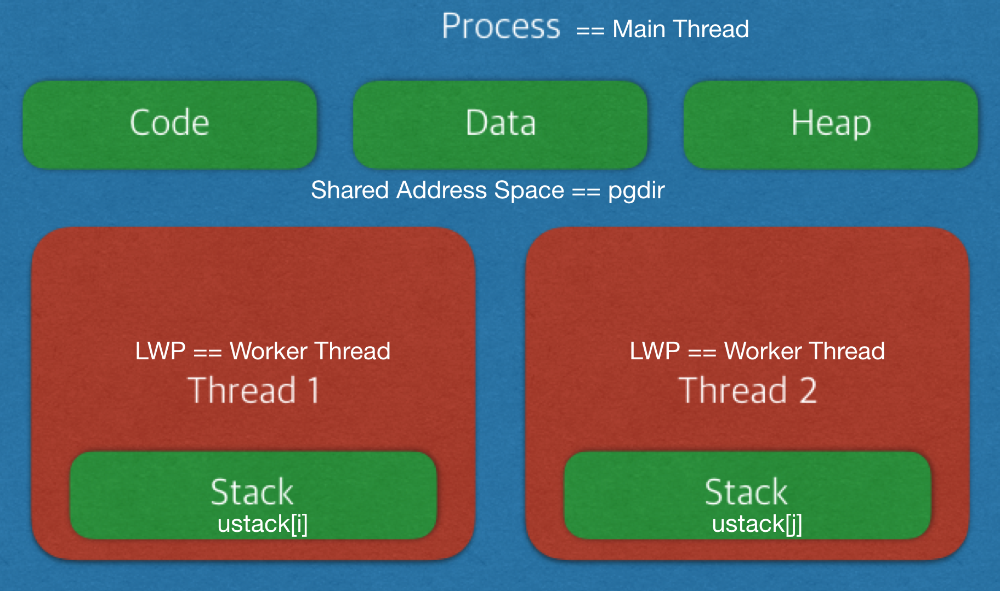

# LWP(thread) implemented xv6

## Table of Contents

## Blueprint

# Terminology

현재 사용된 LWP 구현은 linux의 명세를 많이 따랐습니다. 
이에 혼용을 최소화 하기 위하여 기존 프로세스를 main thread, LWP를 worker thread(코딩 도중에는 child thread라 생각하여 cthread가 약자임)라 칭하도록 하겠습니다. 
xv6는 프로세스가 스케쥴링의 기본 단위임에도 불구하고, 스레드가 스케쥴링의 기본 단위인 리눅스의 명세를 따르다보니 디자인할시에 헷갈리는 부분이 생겨 기본적으로 LWP는 단일로 존재할 수 있는 프로세스가 아닌 main thread에 속해있는 thread라고 생각하고 디자인을 하였습니다. 
즉 어떠한 상황에서도 process가 사용되어야 할 자리에 worker thread가 나올 수 없습니다. 

* LWP는 parent process가 될 수 없습니다. LWP가 fork를 호출할경우 해당 thread내용이 fork되지만 parent process는 curproc->mproc입니다. 
* LWP는 main thread와 같은 pid를 가지고 있습니다. 기존에 분배하던 nextpid 값은 tid가 소유하며 이는 이전 pid와 마찬가지로 allocproc이 호출될 때마다 증가하는 값을 가집니다. 
* LWP는 새롭게 생성된 변수인 `cthread[NPROC]`, `ustack[NPROC]`, `rrlast`, `spinlock` 등을 관리하지 않습니다. 이 변수들은 Process내에서 main thread만이 관리하는 변수들입니다. 

## Proc Structure

스레드와 관련되어 추가된 변수들은 proc 구조체에서 아래쪽에 위치하고 있습니다. 

* `int tid`: allocproc에서 pid와 같은 값으로 초기화 됩니다. 만약 main thread라면 pid == tid이며 worker thread의 pid는 main thread와 같기 때문에 tid 값으로 관리합니다. 함수 콜에서 사용하는 pthread_t는 해당 tid를 사용하여 thread를 관리합니다. 

   

* `struct proc *mthread`: 현재 thread의 main thread를 가리킵니다.  
     main thread는 자기자신을 가리키고 있기 때문에 현재 proc이 main thread인지 worker thread인지는 curproc->mthread == curproc 을 확인하면 됩니다. 

     

* `struct proc *cthread[NPROC]`: main thread는 cthread 배열 구조체를 이용하여 직접적으로 worker thread에 접근할 수 있습니다. cthread[i] == NULL이라면 해당 index는 아직 비어있는 상태라고 판단합니다. 이때의 index를 이용하여 `*ret[]`과 `ustack[]`에 접근하기 때문에 해당 index는 중요합니다. cthread[i]는 `thread_create()`에서 할당되며, `thread_join()`, `wait()`, `exit()`에서 해제될 수 있습니다. 
     **구현의 편의성을 위하여 cthread[0]은 항상 main thread입니다.** 

     

* `void *ret[NPROC]`: `thread_exit()`에서 retval 값을 할당받아 저장합니다. 해당 값은 `thread_join()`에서 사용됩니다. **`thread_exit()`을 부르지 않고 worker thread가 start_routine에서 return하며 종료될 시에 retval은 저장되지 않습니다.** 
     이는 xv6에서 main함수가 exit()을 호출하지 않고 return 할 경우 에러가 발생하는 디자인을 따른 결과입니다. Worker thread가 `exit()` 혹은 `thread_exit()` 호출하지 않았을 경우 이는 곧 undefined behavior이며 이에 대한 책임은 user에게 있습니다. 

     

* `uint ustack[NPROC]`: ustack 배열은 `exec()` 배열에서 `allocuvm()`을 통해 딱 한번 할당됩니다. 할당된 ustack은 `deallocuvm()`을 호출하지 않고 `memset()`을 이용해 초기화하며 재사용됩니다. 이를 통해 ustack이 항상 pgdir에서 힙영역과 섞이지 않고 아래쪽에 유지될 수 있습니다. pgdir이 free될때 함께 free되기 때문에 할당과 반환 모두 `exec()`에서 이루어집니다. 이외의 함수는 해당 값을 할당/반환 하지 않고 사용합니다. 

     

* `int rrlast`: stride scheduler에서 round robin을 구현하기 위해 사용되는 변수입니다. 자세한 정보는 Design Policy에서 서술하겠습니다. 

     

* `struct spinlock lock`: 동시 다발적으로 main thread의 정보를 update하는 과정에서 race condition이 일어나는 것을 방지하기 위해 사용되는 락입니다. 
     ptable 락을 잡을 경우 필요가 없지만 이는 더 큰 overhead를 불러올 수 있기때문에 적용하였으며, multi cpu 상황에서 발생할 수 있는 race condition 방지용이기에 CPUS=1인 상황에서는 존재유무가 영향을 미치지 않습니다. 

## Functions

LWP implementation을 위하여 4개의 새로운 함수가 추가되었으며 그 중 3개는 system call입니다. 또한 기존에 존재하던 함수들 또한 변경되었으며 이들은 다음과 같습니다.

### Newly Created

- `int thread_create(thread_t *thread, void *(*start_routine)(void *), void *arg)`: system call
- `void thread_exit(void *retval)`: system call
- `int thread_join(thread_t thread, void **retval)`: system call
- `int killzombie(struct proc* curproc)`

### Fixed

- `int set_cpu_share(int percentage)`
- `struct proc* allocproc(void)`
- `int growproc(int n)`
- `int fork(void)`
- `void exit(void)`
- `int exec(char *path, char **argv)`
- `void procdump(void)`

## Design Policy

코딩을 시작하기전 참고하기 위해 제작한 [draft file](./assets/LWP.pdf)입니다. 

# Test & Result

threadtest 실행시 xv6가 생성하는 proc들의 관계도 입니다.

다음은 xv6 threadtest를 실행하였을때의 결과값입니다.

**※ 현재 Makefile의 CFLAG에 O0 옵션을 줄 경우 컴파일에 실패하는 상황이 발생하고 있습니다. 하여 부득이하게 여전히 O2 옵션을 적용중이며, 이에 따라 test0의 race condition이 발생하지 않습니다.**

threadtest가 종료된 이후 "ctrl+p"를 이용해 `procdump()`를 실행하였을 때 init과 sh을 제외한 zombie proc이 존재하지 않음을 확인할 수 있습니다. 

이는 곧 test 와중에 exit(), thread_exit()등을 통해 발생한 프로세스들이 모두 제때에 ZOMBIE를 정리해 주었음을 의미합니다. 

