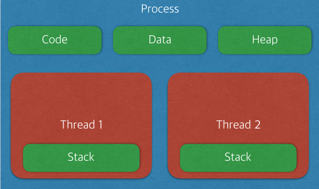

# Light Weight Process - The First Milestone

[](https://hconnect.hanyang.ac.kr/2014004893)

## Process / Thread

프로세스는 프로그램 실행시에 독립된 메모리 영역에 Code, Data, Stack, Heap을 할당받습니다.
이에 반해 스레드는 프로세스는 프로세스에 종속된 개념으로, 프로세스 내에서 Code, Data, Heap을 공유하며 고유의 Stack만을 가지고 있습니다.
Code, Data, Heap 부분의 메모리를 공유하는 만큼 스레드간 데이터의 공유가 간편하며 context-switching 시의 오버헤드 또한 짧습니다.



스레드는 운영체제가 스케쥴링을 실행하는 기본단위이며 프로세스는 생성시에 하나의 스레드(Primary thread)를 할당 받고 필요한 경우 추가로 스레드를 생성하여 하나의 프로세스가
다수의 스레드를 보유할 수 있습니다.

스레드는 메모리를 공유한다는 특징 덕분에 멀티 스레딩간의 자원 공유가 손쉽고 시스템 자원 소모가 줄어들며 응답속도가 단축된다는 장점을 지니고 있지만, 반대급부로 공유된 메모리의 값을 변경하는 operation의 경우
race condition이 발생하여 data corruption이 일어날 수 있기 때문에 조심해야합니다.

xv6는 기본적으로 스레드가 존재하지 않기 때문에 프로세스 = primary thread(main thread)로 치부하기 때문에 각 프로세스가 스케쥴링의 기본 단위입니다.


## POSIX Thread

POSIX Thread(이하 pthread)는 멀티 스레딩을 위해 제공되는 표준 API로 모든 UNIX 계열 OS에서 일반적으로 이용됩니다. 

* ``` int pthread_create(pthread_t *thread, const pthread_attr_t *attr, void *(*start_routine)(void *),void *arg); ```
  * 함수를 부를 프로세스 내에 새로운 스레드를 생성합니다.
    생성된 스레드는 첫번째 인자인 *thread 포인터를 통해 접근할 수 있습니다.
    두번째 인자인 attr은 스레드 특성을 지정하기 위해서 사용하며, NULL을 사용하면 기본 스레드 특성을 할당합니다. 
    3번째 인자인 start_routine는 분기시켜서 실행할 함수를 포인터 형태로 제공하며
    4번째 인자인 arg는 스레드 함수에 제공할 인자입니다.
    성공적으로 스레드가 생성될경우 0을 리턴하고, 실패할경우 errno을 리턴합니다.
  * 생성된 스레드가 종료되는 경우는 다음과 같습니다.
    * 스레드가 pthread_exit()을 호출하였을 경우
    * 스레드의 start_routine으로 부터 return 하였을 경우
    * pthread_cancel()로 스레드가 취소되었을 경우
    * 프로세스의 스레드 중 하나가 exit()을 호출하였을 경우 혹은 main thread(primary thread)가 main에서 return 하였을 경우
* ```int pthread_join(pthread_t thread, void **ret_val);```
  * 첫번째 인자로 주어진 스레드가 종료될때까지 기다립니다. 만약 해당 스레드가 이미 종료되었을 경우 바로 리턴합니다.
  * ret_val이 NULL이 아닐경우 타겟 스레드의 종료 상태를 ret_val에 저장합니다.
  * 리턴값은 성공시 0, 에러시 errno 입니다.
* ```void pthread_exit(void *ret_val);```
  * 호출한 스레드를 종료시키고 return value를 ret_val에 저장합니다. 해당 값은 pthread_join을 통해 사용할 수 있습니다.
  * 스레드에 종속된 값들은 정리되지만 프로세스 종속적인 값들 (공유 메모리, lock etc...)은 변경되지 않습니다.
  * 만약 프로세스 내의 모든 스레드가 종료되었다면 프로세스는 exit(0)을 호출하며 종료됩니다.


##   Design Basic LWP Operations for xv6

xv6에 LWP를 위한 3가지 함수를 추가합니다

* `int thread_create(thread_t * thread, void * (*start_routine)(void *), void *arg);`

* `void thread_exit(void *retval);`

* `int thread_join(thread_t thread, void **retval);`

1. xv6의 thread 또한 proc 구조체를 지니도록 설계합니다. 이때 추가적으로 ```void *stack; struct proc *mainthread; int nthread; int procpercentage```를 proc 구조체에 추가합니다.
2. `allocproc()`에서 nthread = 1로 초기화하고 이외의 해당 값들을 변경하지 않습니다. 즉, 추가적인 thread 생성이 없는 단일 스레드 프로세스는 기존의 코드와 동일한 행동을 합니다.
3. `int nthread; int procpercentage`는 stride scheduling을 위한 값입니다. 
   만약 main thread가 stride proc이었다면 각각의 스레드는 procpercentage / nthread만큼의 stride percentage(~= ticket)을 보유하며 stride scheduler의 영향을 받습니다.
   MLFQ proc이었다면 추가적인 작업이 없이도 정상적으로 MLFQ scheduler의 영향을 받을 것 입니다.
4. `thread_create()`를 통해 새로운 thread가 생성될 경우 allocproc()을 통해 ptable에 자신을 올립니다. 이후 pgdir을 main thread와 동일하게 하여 shared address를 보유합니다.
   이를 통해 공유 메모리를 할당 받은 이후 자신만의 stack을 메모리에 할당시킨 이후 `tf->ebp, tf->esp`를 할당받은 메모리를 가르키게 하고 스택 초기화를 실행시킵니다.
   `tf->eip` 또한 start_routine을 가르키게 합니다. 스택과 공유 메모리를 사용한다는 점을 제외하고는 `fork()`와 유사한 부분이 많기 때문에 `fork()` 함수를 참고하도록 합니다.
5. `thread_join()`과 `thread_exit()`은 기존 sleep, kill, wait 과 유사한 부분이 있습니다. 
   `thread_exit()`시에 스스로를 zombie로 만들고 main thread가 retval을 참조한 후 UNUSED로 변경할 수 있도록 합니다.
   또한 이때에 stride proc 이었다면 정상적인 percentage(ticket)이 일어나도록 주의합니다.
   **TODO** 이때에 `thread_exit()`이 아닌 statrt_routine으로 부터의 return 또한 `thread_exit()`과 동일한 효과를 내도록 추가적인 작업이 필요합니다.
6. 만약 main thread가 종료되었다면 해당 프로세스 내의 다른 스레드들 또한 함께 종료되어야 합니다. 
   proc 구조체 내의 nthread != 1 일 경우 ptable을 탐색하여 추가 스레드를 찾아낸 후 ZOMBIE 상태로 만들고, ticket의 반환에 주의합니다.
7. 임의의 thread가 `exit()`을 호출하였을 경우도 6과 동일한 형태로 진행하도록 합니다.
   현재로서는 호출한 thread에서 main thread를 `kill()`시키도록 하여 6번을 수행하도록 하는 방법을 생각하고 있습니다.
8. thread에서 `fork()`를 수행할 경우 새로운 proc을 생성하되 기존 proc의 thread들까지 동이랗게 생성할 필요는 없다고 판단됩니다. 
   main thread 하나만이 생성되도록 기존 `fork()` 함수를 사용하며 이때 shared memory를 제대로 복사할 수 있어야합니다.
9. thread 내에서 `exec()`가 실행될시 해당 proc은 더이상 main thread에 종속된 thread가 아닌, 새로운 proc 취급을 받습니다.
    이에 main thread의 nthread등 추가적인 변수의 변경 후 exec되도록 신경써야 합니다.


추가적인 변경사항이 있을시 해당 마일스톤을 변경하겠습니다.