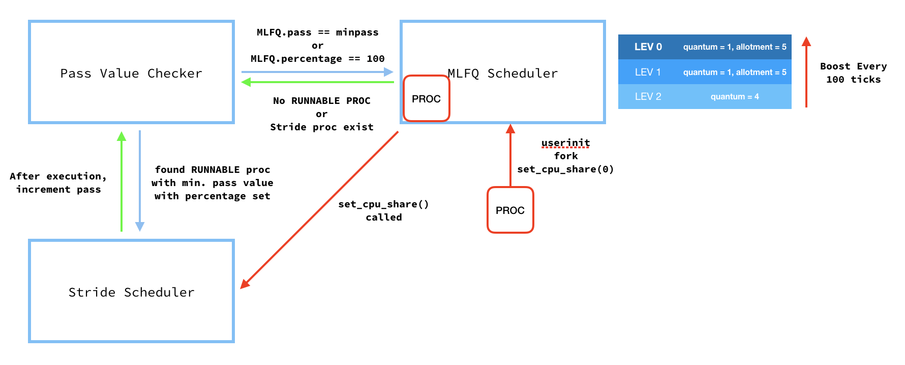

# MLFQ&Stride scheduler implemented XV6

[](https://hconnect.hanyang.ac.kr/2014004893)

## 사전정보

기존 Round Robin 정책을 사용하는 xv6의 Scheduler를 MLFQ를 기반으로 하는 Scheduler로 업데이트하고, 이후 CPU SHARE 설정이 가능한 Stride Scheduler 까지 함께 적용시킵니다.<br>
모든 프로세서는 기본적으로 MLFQ Scheduling을 기반으로 동작하되, 프로그램 내부에서 `set_cpu_share()` 함수를 실행시킬 경우 Stride Scheduler의 영향을 받습니다.<br>
모든 변경사항은 proc.h, proc.c에 위치하며 tick increment를 위한 trap.c에서의 변경사항을 제외한 나머지 변경사항은 모두 올바른 function call을 위한 변경사항입니다.

Table of Contents
=================

<!--ts-->
   * [Blueprint](#blueprint)
   * [MLFQ Scheduler](#mlfq-scheduler)
	  * [구조체](#구조체)
	  * [추가된 함수](#추가된-함수)
	  * [Scheduler](#scheduler)
   * [Stride Scheduler](#stride-scheduler)
	  * [Exception Handling](#exception-handling)
	  * [구조체](#구조체-1)
	  * [추가된 함수](#추가된-함수-1)
	  * [Scheduler](#scheduler-1)
   * [Tests & Results](#Tests--Results)

<!--te-->

# Blueprint

<br>

# MLFQ Scheduler

* 3 Level of Priority (Starting from Highest to Lowest Priority)
	* time quantum:		1 tick
	* time allotment:	5 tick
		* time quantum:		2 tick
		* time allotment:	10 tick
			* time quantum:		4 tick
* To prevent startvation, priority boosting is performed for every 100 ticks (`boostpriority()` 참조)

### 구조체

```
// Per-process state
struct proc {// proc.h
	...
	int ticks;                   // Runtime of program before change of priority
	int curticks;                // Runtime of program before yield
	int priority;                // Current position of queue(if MLFQ)
	int timequantum;             // Maximum time program can run without timer interrupt
	int timeallotment;           // Priority will be decreased if reached.
};

struct mlfq {// proc.h
	struct proc *queue[3][NPROC]; // 0 is the highest priority
	int index[3];                 // Indicate start position for the round robin scheduling.
};

struct {// proc.c
	struct spinlock lock;
	struct proc proc[NPROC];
	struct mlfq mlfq;             // mlfq structure added
} ptable;
```
사용된 구조체의 초기화는 생성시 `allocproc()`, 소멸시 `wait()` 함수에서 처리합니다.<br>
이는 proc을 생성하는 `userinit()`, `fork()` 모두 allocproc을 사용하여 ptable에 접근하고<br>
proc 소멸에 사용되는 `exit()`, `kill()` 함수의 뒷처리는 모두 parent proc의 `wait()`이 관여하기 때문입니다.

### 추가된 함수

* **System Call**

	* `void yield(void)` : cpu 점유를 다음 프로세서에게 넘긴다.
	* `int getlev(void)` : 현재 프로세서의 MLFQ scheduler 상의 priority level을 반환한다.<br>
	*stride scheduling의 영향을 받는 프로세스가 getlev를 호출할시 반환되는 리턴값은 쓰레기 값이다.<br>(Stride로 넘어가기 직전의 priority level)*
* proc.c<br>
top()을 제외한 모든 함수는 호출되기전에 ptable.lock을 획득하여야한다.<br>
	* `void initpush(struct proc* queue[], struct proc *p)`<br>
	해당 queue에 proc을 넣고 다음 scheduling시에 우선적으로 실행될 수 있는 우선권을 부여한다.
	* `void push(struct proc* queue[], struct proc *p)`<br>
	해당 queue에 proc을 넣는다. 이때의 push는 drop, boost priority에서도 사용되며,<br>next running의 첫번째로 주기에는 기존에 대기하던 proc들에게 불공평하다고 판단되어 initpush와 달리 실행에 있어 우선권을 주지 않는다.<br>이것이 initpush와 push의 유일한 차이점이다.
	* `struct proc* top(struct proc* queue[], int priority)`<br>
	RUNNABLE인 proc을 찾아 반환한다. 이때 반환된 proc은 큐에서 빠지지 않는다.(C++ STL과 동일)
	* `void pop(struct proc* p)`<br>
	해당 proc을 queue에서 제거한다. MLFQ에 존재하지 않는 proc을 pop하려는 행위는 잘못된 접근으로 판단하여 panic을 일으킨다.
	* `void droppriority(struct proc* p)`<br>
	priority가 0 혹은 1일때 프로세스의 tick >= time allotment가 되면 priority를 조정한다.<br>기존의 queue에서 pop 한 후 한단계 낮은 priority의 queue에 push한다.<br>Lowest priority queue에서 droppriority()를 호출할시 panic을 일으킨다.
	* `void boostpriority(void)`<br>
	PBOOST로 지정된 tick(default 100)만큼의 tick이 지날시 모든 MLFQ proc을 highest priority queue로 돌려넣는다.<br>이때의 tick 계산은 기본 탑재된 xv6의 tick이 아닌 MLFQ proc들이 사용한 tick들 만을 더해서 계산한다.

### Scheduler

ptable.lock을 획득한 이후

```
int i = 0;
for (;;) {
	int boosted = 0;
	if (i >= 3)
		break;
	p = top(ptable.mlfq.queue[i], i);
	while (p != NULL) {
		c->proc = p;
		switchuvm(p);
		p->state = RUNNING;
		swtch(&(c->scheduler), p->context);
		p->ticks++;
		p->curticks++;
		runningticks++;
		// If more than 100 ticks after previous boost is detected.
		// only calculates ticks occured during execution of MLFQ scheduling.
		if (runningticks >= nextboost) {
			nextboost = runningticks + PBOOST;
			boostpriority();
			boosted = 1;
			break;
		}
		if (p->priority != 2 && p->ticks >= p->timeallotment)
			droppriority(p);
		p->curticks = 0;
		switchkvm();
		c->proc = 0;
		p = top(ptable.mlfq.queue[i], i);
	}
	if (boosted)
		i = 0;
	else
		i++;
}
```
를 반복 실행합니다.<br>
higher priority queue에 proc이 존재할시 lower priority queue의 proc은 실행되지 않으며 매 100 tick마다(+오차 최대 4tick. 마지막 실행 proc의 time quantum을 보장해주기 때문에)<br>
boost priority가 일어남을 확인 할 수 있습니다. test_mlfq를 통해 여러개의 proc을 돌릴수록 proc이 queue[0]에 있는 시간이 더 길어짐을 확인 할 수 있는데, <br>
이는 다른 proc의 tick에 의해서도 boostpriority가 일어나기 때문으로, 지극히 정상적인 반응입니다.<br>
mlfq proc의 갯수와 상관없이 queue[0]과 queue[1]의 비율은 1:2를 계속 만족함을 확인함으로서 MLFQ의 정상작동을 확인할 수 있습니다. *(결과값은 [result.md](./result.md) 참조)*<br>

```
if(myproc() && myproc()->state == RUNNING &&
	tf->trapno == T_IRQ0+IRQ_TIMER) {
	if ((myproc()->curticks+1) % myproc()->timequantum == 0) {
		//Because yield will lead into scheduler() and it will raise tick from there,
		//check for current tick + 1.
		yield();
	}
	else {//if time quantum is not reached, add 1 tick to both global mlfq tick and current proc tick.
		myproc()->ticks++;
		myproc()->curticks++;
		runningticks++;
	}
```
tick은 scheduler내부 외에 **trap.c**에서도 yield로 넘어가지 않을시 tick을 카운트해줍니다.<br>
curticks은 이전 RUNNING에서 프로그램이 yield()를 호출하였을 경우 모듈로 연산으로는 이번 RUNNING의 정확한 tick count가 불가능하여 추가되었습니다<br>
curticks의 경우 일반 ticks과 동일하게 증가하지만 sched()를 통해 shceduler로 돌아왔을 경우 항시 0으로 초기화되어 다음 RUNNING에서의 clean count를 보장합니다.<br>
만약 yield로 넘어갈 경우 scheduler의 swtch 다음명령부터 실행하기 때문에 scheduler내부의 tick count가 대신 계산해줍니다.

> STRIDE(30%), cnt: 1320<br>
> STRIDE(40%), cnt: 2018<br>
> STRIDE(10%), cnt: 415<br>
> MLFQ(compute), lev[0]: 1845, lev[1]: 3544, lev[2]: 14612<br>
> MLFQ(yield), lev[0]: 1024, lev[1]: 2045, lev[2]: 16932<br>

만약 MLFQ(compute) 와 MLFQ(yield)를 같이 실행할 경우 compute의 queue[0]의 값이 더 큰 것을 확인 할 수 있는데<br>
이는 yield를 프로그램 내부에서 실행하는 MLFQ(yield)의 경우 1tick(10ms)가 되기전에 tick이 증가되어 실제 실행시간 대비 틱 증가속도가 더 빨라<br>
higher queue에서 time allotment에 더 빨리 도달해 동작시간대비 `droppriority()`가 더 빠르게 일어나기 때문입니다.<br>
이는 yield를 사용하는 프로그램이 scheduler를 속이는(game the scheduler) 상황을 방지하기 위해 1 tick보다 더 적은양을 반복적으로 수행하며 priority를 유지하는 상황을 방지하기 위해 디자인한 결과입니다.

> MLFQ(compute), lev[0]: 5370, lev[1]: 10355, lev[2]: 4276<br>
> MLFQ(compute), lev[0]: 5800, lev[1]: 11571, lev[2]: 2630<br>
> MLFQ(compute), lev[0]: 5788, lev[1]: 11615, lev[2]: 2598<br>
> MLFQ(yield), lev[0]: 3047, lev[1]: 6120, lev[2]: 10834<br>
> MLFQ(yield), lev[0]: 3059, lev[1]: 6119, lev[2]: 10823<br>
> MLFQ(yield), lev[0]: 3055, lev[1]: 6127, lev[2]: 10819<br>

또한 어떤 종류의 MLFQ이든 실행하는 프로세스가 증가할수록 levl[0]의 값이 증가하는 것을 확인할 수 있는데<br>
이또한 자기자신의 프로세스의 실행속도는 동일하지만 다른 MLFQ 프로세스의 실행량이 증가함으로 인해 boostpriority가 더 자주 일어나는 상황이 발생하기 때문입니다.

# Stride Scheduler

변경된 xv6의 scheduler는 기본적으로 MLFQ를 바탕으로 동작합니다.<br>
만약 프로그램이 내부에서 `set_cpu_share()` 함수를 부른 경우, system call을 통해 해당 proc은 ticket값을 배당받고 이후 MLFQ sheduler가 아닌 stride scheduler의 영향을 받습니다.<br>
MLFQ scheduler 또한 일종의 프로그램으로 취급하여 Stride Scheduler의 영향 아래에 있으며 MLFQ는 최소 20%의 cpu share를 보장받습니다.<br>
MLFQ scheduler의 차례가 되었을시 MLFQ는 하나의 proc을 실행할 수 있으며 이때 MLFQ의 pass는 stride * p->timequantum 만큼 증가합니다.<br>
이는 stride scheduler의 영향 아래 있는 proc은 항시 1 tick이후 time interrupt로 yield하지만 MLFQ의 proc은 여전히 해당 priority의 time quantum을 보장받기 때문입니다.<br>
`set_cpu_share()`의 중복 사용도 허용되며 자세한 내용은 [Exception Handling](#exception-handling)을 확인해 주시기 바랍니다.

### Exception Handling

* MLFQ Scheduler는 최소 20%의 지분을 보장받습니다. 즉, 다수의(혹은 단일의) 외부 프로그램이 80%를 초과하는 cpu share를 할당받으려 할시 `set_cpu_share()`는 -1을 리턴합니다.
* 하나의 프로그램은 `set_cpu_share()` 함수를 한 번 이상 호출할 수 있습니다.<br>
이때 해당 프로그램의 cpu share은 마지막 함수 호출시의 %로 할당되며, 해당 호출로 인해 MLFQ가 20%의 지분을 보장받지 못할시 cpu share는 이전 호출시의 cpu share에서 변하지 않으며 -1을 리턴합니다.
* cpu share를 할당받은 프로그램은 이후 가장 먼저 실행됨을 minpass를 통해 보장받습니다.
* `set_cpu_share()`를 처음 콜할때 percentage = 0을 입력할경우 -1을 리턴합니다.<br>
**하지만 한 proc의 2번째 콜에서 0을 받을경우 stride scheduler에서 빠져나와 MLFQ scheduler로 돌아갑니다.**<br>
* 전체 xv6에서 단일 stride proc이 유일하게 RUNNABLE인 proc일 경우 CPU의 지분을 모두 가져가는 현상이 발생합니다. 이는 idle process를 따로 두지 아니하고<br>
mlfq scheduler에서 RUNNABLE을 찾지 못하였을때 추가적은 tick을 사용하여 cpu를 spin 시키지 않고 바로 stride scheduler로 cpu를 할당해주기 때문입니다.<br>
이경우 불필요한 cpu의 낭비를 막을 수 있지만 사용자가 이를 악의적으로 활용할 경우 자신의 proc을 stride로 설정하고 나머지 모든 RUNNABLE proc을 kill/sleep 시킬경우<br>
percentage에 상관없이 모든 cpu share를 사용할 수 있다는 단점이 있습니다.<br>
허나 현재의 xv6에서 이러한 유저의 시스템 허점의 이용을 막기보다는 성능을 챙기는 것이 우선이라고 판단하여 지금과 같은 디자인을 하게 되었습니다.<br>

### 구조체

```
struct proc {
	...
	int percentage;                 // If 0, it means it's MLFQ. Else consider it as a stride scheduler.
	int pass;                    // Counter for stride sceduling
};

struct mlfq {
	...
	int percentage;                  // If 0, it means it's MLFQ. Else consider it as a stride scheduler.
	int pass;                     // Counter for stride sceduling
};

struct {
	...
	int minpass;              //minimum pass value of all proc.
} ptable;
```
모든 proc과 mlfq 구조체에 pass와 percentage 변수를 추가합니다.<br>
xv6 시작시 mlfq 구조체는 100을 할당받으며 이후 다른 proc이 cpu share를 할당받을시 mlfq 구조체에서 percentage을 가져가고 종료시에 되돌려 받는 구조입니다.<br>
만약 proc의 percentage가 0이라면, 이는 해당 proc이 MLFQ scheduling을 바탕으로 동작한다는 것을 의미합니다.<br>
또한 stride scheduling을 위한 minpass를 ptable이 보유하고 있으며 새로운 proc이 `set_cpu_share()`를 호출할시 해당 minpass를 pass변수에 할당받아 다음 scheduling에서 실행됨을 보장받습니다.

### 추가된 함수

* **System Call**
	* `int set_cpu_share(int percentage)` : 파라미터만큼의 cpu share를 할당받습니다.<br>
	이후 proc은 Stride Scheduler의 영향을 받습니다. 리턴값은 성공시 cpu share, 실패시 -1을 반환합니다.<br>
	만약 2번째 콜의 인자가 0일시 stride scheduling에서 빠져나와 다시 MLFQ scheduling으로 돌아갑니다.<br>

### Scheduler

Stride Scheduler는 `set_cpu_share()`이외에 함수가 추가되지 않습니다.<br>
대신, 기존 scheduler 함수가 stride scheduling과 MLFQ scheduling을 모두 다뤄야 하는 만큼 그 내부가 복잡해진 형태를 띄고 있습니다.<br>
무한 반복하는 Scheduler의 for문 내부부터 차례대로 보도록 하겠습니다.

```
//start checking pass val of all procs & MLFQ
int minpass = ptable.mlfq.pass;

//mlfq.tickets == MAXTICKET means there is no stride proc for now.
//thus we can skip comparing part. Else look for the proc with min. pass.
if (ptable.mlfq.tickets != MAXTICKET){
	for (int i = 0; i < NPROC; i++) {
		if (ptable.proc[i].tickets == 0 || ptable.proc[i].state != RUNNABLE)
			continue;
		if (minpass > ptable.proc[i].pass) {
			p = &ptable.proc[i];
			minpass = p->pass;
		}
	}
}
ptable.minpass = minpass;
```
stride scheduler가 다음에 실행시킬 proc을 찾는 부분입니다.<br>
MLFQ의 pass값을 받아온 후 모든 ptable내 모든 proc을 확인하며 ticket을 가지고 있다면(stride scheduling이라면) pass값을 확인하여 minpass를 update 시킵니다.<br>
만약 MLFQ의 pass가 minpass라면 MLFQ shceduler를 실행시킵니다.

```
// MLFQ scheduling
if (minpass == ptable.mlfq.pass) {
	// If monopoly is set, there is no stride proc on the system for now.
	// run all queues until empty. If stride proc is found while running,
	// exit from the for loop.
	// If not set, run only one proc from the queue and go back to
	// finding min. pass.
	int done = 0, monopoly = 1;
	// Increment stride pass for MLFQ only if there is other stride proc running.
	if (ptable.mlfq.tickets != MAXTICKET) {
		ptable.mlfq.pass += (int)(MAXTICKET/ptable.mlfq.tickets);
		monopoly = 0;
	}
	int i = 0;
	for (;;) {
		int boosted = 0;

		if (i >= 3)
			break;
		p = top(ptable.mlfq.queue[i], i);
		while (p != NULL && (monopoly || !done)) {
			c->proc = p;
			switchuvm(p);
			p->state = RUNNING;
			swtch(&(c->scheduler), p->context);
			done = 1;
			p->ticks++;
			p->curticks++;
			runningticks++;
			//Because MLFQ runs continuously, pass is increased by stride * quantum.
			if (ptable.mlfq.tickets != MAXTICKET)
				ptable.mlfq.pass += (int)(MAXTICKET/ptable.mlfq.tickets) * (p->curticks - 1);
			// cprintf("p->tickets: %d\n", p->tickets);
			// If more than 100 ticks after previous boost is detected.
			// only calculates ticks occured during execution of MLFQ scheduling.
			if (runningticks >= nextboost) {
				nextboost = runningticks + 100;
				boostpriority();
				boosted = 1;
				break;
			}
			if (p->priority != 2 && p->ticks >= p->timeallotment)
				droppriority(p);
			if (p->tickets != 0)// set_cpu_share has been called for current proc.
				monopoly = 0;
			p->curticks = 0;
			switchkvm();

			c->proc = 0;
			if (boosted)
				p = NULL;
			else
				p = top(ptable.mlfq.queue[i], i);
		}
		if (boosted)
		else
			i = 0;
			i++;
	}
}
```
이때 MLFQ의 ticket이 MAXTICKET이라면 아직 cpu share를 받은 proc이 존재하지 않는다는 뜻이므로 `set_cpu_share()`함수가 호출되기 전까지 mlfq scheduling을 진행합니다.<br>
이경우 pass값을 증가시키지 않으며 `set_cpu_share()`의 호출은 p->tickets의 값을 확인하여 0이 아닐시 MLFQ의 무한루프를 빠져나가 stride scheduler로 돌아갑니다.<br>
**일반 stride scheduling의 proc은 1 tick이후 time interrupt로 yield되는 반면 mlfq scheduling의 proc은 여전히 해당 priority의 time quantum을 보장받는다는 것 입니다.<br>
이에 따라 MLFQ scheduler의 pass는 1회 실행시에 stride만큼이 아닌, stride * (실행 proc의 time quantum)만큼 증가됩니다.**

```
// Stride Scheduling
else {
	// cprintf("p pass: %d\n", p->pass);
	if(p->state != RUNNABLE)
		continue;
	c->proc = p;
	switchuvm(p);
	p->state = RUNNING;

	swtch(&(c->scheduler), p->context);
	p->pass += (int)(MAXTICKET/p->tickets);
	// cprintf("mlfq pass: %d\n", ptable.mlfq.pass);
	switchkvm();

	// Process is done running for now.
	// It should have changed its p->state before coming back.
	c->proc = 0;
}
 ```
만약 minpass를 가진 proc이 MLFQ가 아니라면 해당 proc을 실행시킵니다.<br>
이미 minpass를 확인하는 과정에서 변수 p가 해당 proc을 가르키고 있으므로 기존 xv6의 scheduler와 비슷하게 동작하며, pass 값을 증가시키는 부분이 추가되었습니다.

# Tests & Results

스크린샷이 많은 관계로 [result.md](./result.md) 파일을 확인해주시기 바랍니다.
