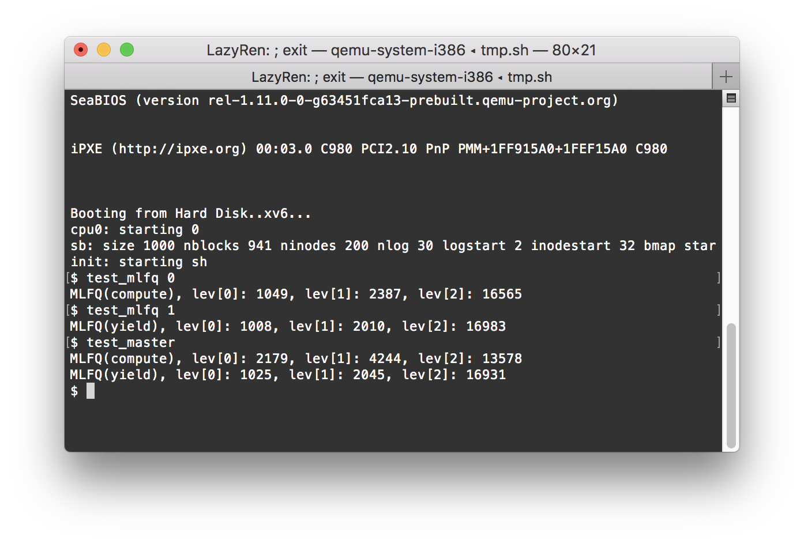
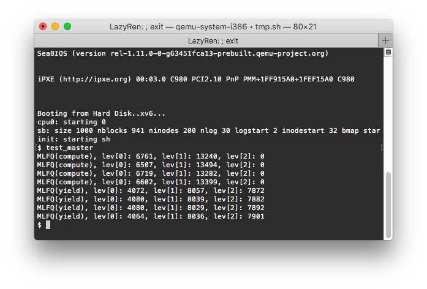
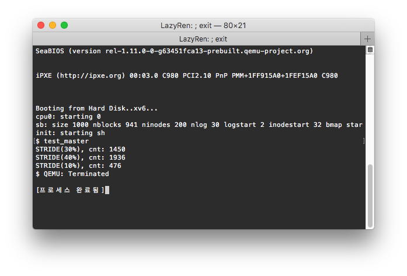
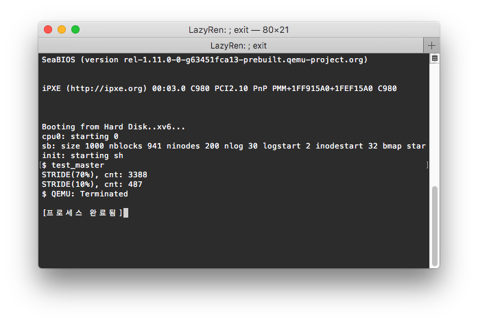
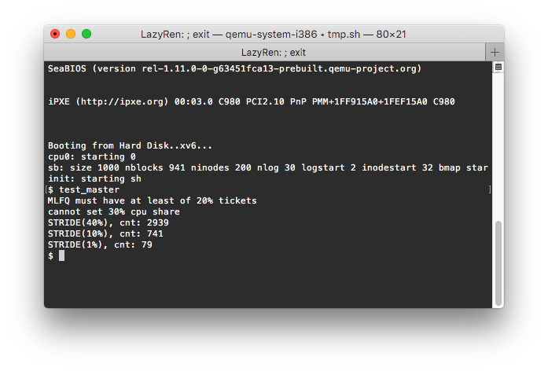

# Tests

## Test_MLFQ

### compute & yield 각각 실행
 
lev[0]:lev[1]의 비율이 오차범위 이내에서 1:2를 만족하고 있습니다. 
각 lev의 time allotment가 5:10 인 것을 생각해보았을 때 `boostpriority()`가 일어나도 1:2의 비율을 만족하여야 한다는 것을 알 수 있습니다. 

### compute & yield 함께 실행
 
MLFQ(yield)의 lev[0]에 비해 MLFQ(compute)의 lev[0] 값이 2배 가까이 큰 것을 확인할 수 있습니다. 
[game the scheduler](./DevNote.md#scheduler)를 방지하기 위해 실제 1 tick이 지나지 않았어도 프로그램이 yield()를 호출하였을 경우 1 tick을 사용한 것으로 계산하여 
실제 실행시간 대비 tick이 더 빠르게 증가합니다. 결국 drop priority가 실행시간에 비해 많이 발생하여 lev[0]에 상주하는 시간이 더 짧기 때문입니다. 
 
 
yield와 compute를 각각 2개씩 실행시킨 모습입니다. 여러개의 mlfq proc이 돌수록 global tick(code상의 runningticks)가 자기자신의 tick에 비해 빠르게 증가하여, 
`boostpriority()`가 자주 발생합니다. proc의 갯수가 2배 증가한만큼 lev[0]의 값 또한 2배가까이 증가한 것을 확인할 수 있습니다. 

 
3개씩 실행시킨 결과 또한 별 차이가 없습니다. 다만, proc의 갯수가 늘어날수록 (자신의)실행 tick 대비 `boostpriority()`의 빈도가 늘어나 lev[0]의 값이 점점 커집니다. 

 
각각 4개씩 실행시킬경우 compute proc이 lev[2]에 도달하기 전에 boostpriority가 일어나 lev[2]의 값이 0임을 확인할 수 있습니다. 

## Test_Stride

 
Stride 3개가 각각 10%, 30%, 40% share를 가지고 총 80% Share를 보유한 상태에서 모든 프로그램 종료후의 모습입니다. 
1:3.04:4.07 으로 정확한 비율을 유지하고 있음을 확인할 수 있습니다.

 
stride 2개가 10% 70%으로 분할한 모습이며 이또한 1:6.96의 비율을 유지하고 있습니다. 

 
1%, 10%, 30%, 40% 총 81%를 Stride Scheduler가 할당받으려 하자 `set_cpu_share()` 함수에서 막는 모습입니다. 
MLFQ는 항시 최소 20%의 지분을 가지고 있어야하며, 이는 Stride program이 `set_cpu_share()`를 두번 이상 불러 재할당 받을때에도 적용됩니다. 

 
1 ~ 10% 10개의 proc도 정상적으로 출력됩니다. 

## Test_Master

test_master에서는 MLFQ와 Stride scheduler를 동시에 돌립니다. 
Stride scheduler는 항상 1 tick이후 yield하는 반면 MLFQ는 한번 돌때에 최대 time quantum만큼 돌 수 있으므로 pass값 증가에 주의합니다. 

 
MLFQ yiel, compute와 Stride 모두 3개씩 실행시킨 결과입니다. 
모두 각각을 돌렸을때와 마찬가지로 이상없이 돌아갑니다. 
각각 10개 이상의 proc을 돌려도 이론상으로 / 결과값으로 이상이 없지만 xv6의 printf의 한계상 출력에 lock을 잡지않아 printf 결과값이 corrupt되어 정상적인 결과값 확보가 불가능합니다. 

 
stride 10개, MLFQ yield, compute 각각 5개 총 20개의 proc을 한꺼번에 돌린 결과입니다. 

# Results

## Test_MLFQ

 
 
MLFQ로 yield와 compute를 각각 1개 ~ 4개까지, 총 proc 최대 8개까지 돌렸을때의 cnt 값과 그때의 lev1/lev0 ratio 값입니다. 
ratio 값이 안정적으로 2를 보이고 있다는 점에서 time allotment에 의한 drop priority가 잘 작동하고 있음을 알 수 있습니다. 

# Test_Stride

 
1%의 cnt값과 각각의 %에서의 cnt값을 비교하여 ratio로 나타내었습니다. 
조금씩의 오차가 존재하지만 ratio 값과 Stride %사이의 상관관계를 나타내기에는 충분합니다.
