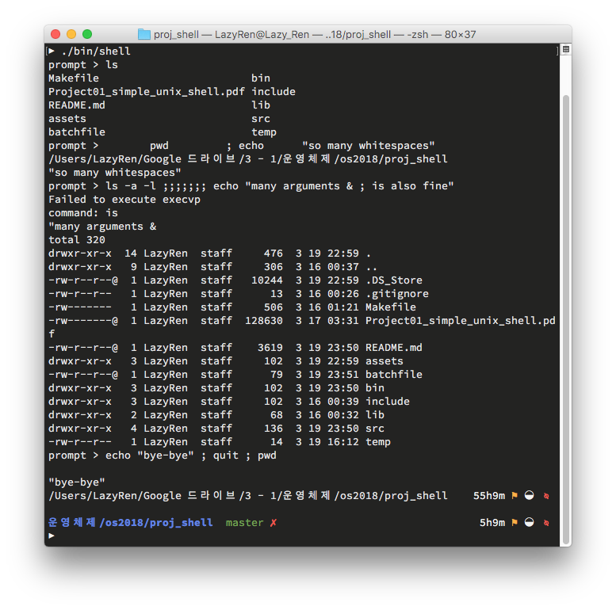
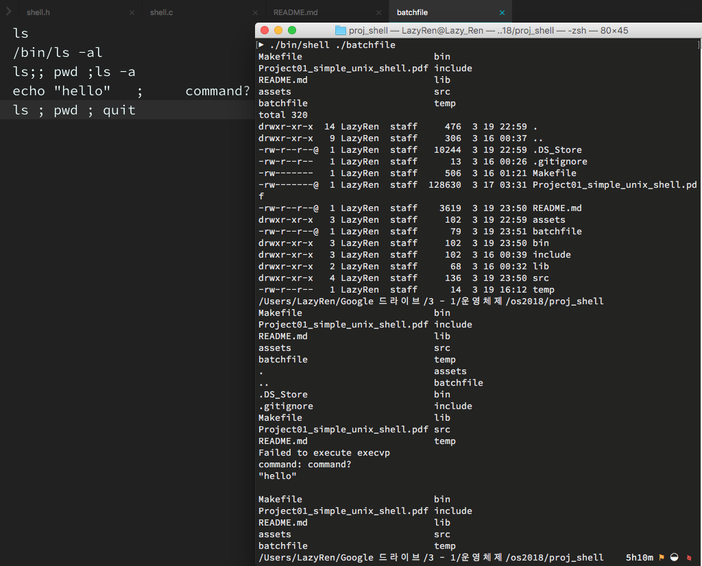

# Simple User-level Unix Shell

This is the basic user-level unix shell that can be used to run simple commands or batchfile.

# Usage

This shell supports two types of mod.
- Interactive mode
	- If the executive file starts **without any argument**, shell is started as an interactive mode.
	- In this mod, user can type multiple commands within one commandline using **";"**, or keep typing any number of commandlines.
	- To exit from the interactive mode, press **"ctrl + D"** or type **"quit"** as a command.
- Batch mode
	- If one argument is provided at the execution, shell will be executed in batch mode, in this mod, it will read any commands within the file that has been provided as an argument.
	- reaching **EOF** or command **"quit"** within file will result in program termination.
	- If more than two arguments are provided, shell will print error and terminates.

### Important Restriction

- If you want to run batchfile, remember that only one batchfile can be run at a time. More than two arguments for the shell program will result in error.
- Each **commandline**'s maximum length is 1024 characters 
- Each **command**(separated by ";" within commandline)'s max length is 128.
- Maximum **number of argument** for each command is 16. 
	- It can be easily changed. Please check #define at shell.h to change the limitation. Nothing more than changing #define in shell.h is required.
- Some shell commands such as"cd, exit ..." will not work due to restriction of **execvp** function.

# Code Guidance

There is only four functions.

- void execute_cmdline();
- void execute_cmd(char *cmd);
- size_t trim_whitespace(char *out, size_t len, const char *str);
- static void sig_fn(int signo);

### execute_cmdline()

Both interactive mode and batch mode deals with accepting commandline in main() using fgets(). Since there is nothing much to say about it, I'll just pass to execute_cmdline(). 
After fetching commandline from stdin(whether it's interactive or batch), program saves string to global variable cmdline_input and run execute_cmdline() 
execute_cmdline() has 4 features.
1. Tokenize commandline with " " as delimiter.
2. fork child process for future use.
3. trim any unnecessary white spaces before/after command.
4. pass commnd to execute_cmd() and keep repeat 1-4 until there is no more command left in commandline

### execute_cmd()

Since execute_cmdline() already separated command from commandline, execute_cmd will only deals with separating aruments and executing actual command. 
execute_cmd() has 3 features.
1. separate arguments from command and save it to **char \*\*argv**
2. check if the command is **quit**. If so, send **SIGINT** to parent process to terminate program.
3. execute command using execvp().
Notice that argv is declared as 2d array and carefully freed for any error or before execution of execvp to make sure there is no memory-leak.

### trim_whitespace()

**This function is written by Adam Rosenfield. Please check "shell.h" for further information.** 
Function checks if there is unnecessary leading and trailing whitespaces from string, and truncate it. trimmed string will be saved to char *out.

### sig_fn()

This function is called only when "quit" command is received. Child process will raise SIGINT to parent process which will invoke this function. 
It Simply waits for any remaining child process to finish after all commands are executed, terminate shell program.

# Screenshots

### Interactive Mode

### Batch Mode

